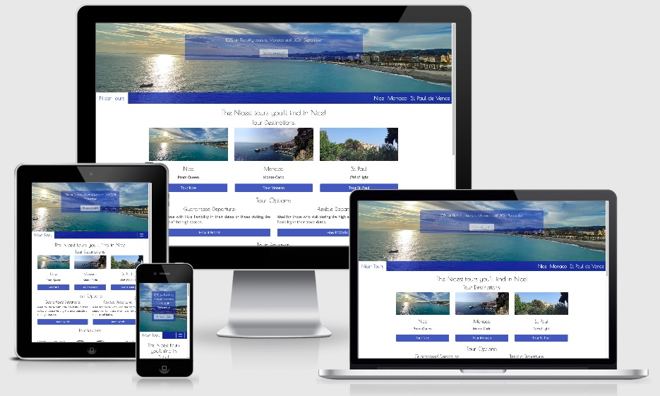

<h1 align="center"><a href="https://justin-sawyer.github.io/nicer-tours/index.html">Nicer Tours</a></h1>

This is my User Centric Frontend Development Milestone Project for Code Institute. 
It is a resposive website designed to be accessible on all web browsers. 

The brief for the project is to create a three page website, using HTML5 and CSS as the core languages. 

## User Experience (UX)

- ### User stories:
    - #### First time visitors:

        1) As a first time visitor, I am either planning or am on my vacation in Nice, France and I want to visit a website that informs me about
the most interesting sights and places I can visit while on this vacation.

        2) I want to have my interest piqued while I view the website, and thus choose to make a booking for a tour.

        3) As a first time visitor to the website and perhaps to the geographical area covered in the site, 
I am perhaps uninformed about the area I am visiting, and thus want to be informed first and foremost 
before choosing to book or not. Because of this, I do not want to feel pressured to buy, however a 
little special offer may help me choose this company rather than another.

        4) I want to be able to navigate through the website easily, and be prompted where necessary to either 
contact the site creators (and service vendor) or make a booking easily if I choose to.

        5) As a first time visitor who is also on vacation, I want to be sure that I have made the right choice of 
tour company, so customer reviews and social comments about the company are very important.

    - #### Returning visitors:

        1) As a returning visitor, I want to be able to add my story to the many reviews I have seen on the website.

        2) As I will be returning to the site almost definitely after having taken a tour, I want to both be reminded 
of the fun I had, and also be able to inform others about the service offered by the company. Thus, good 
navigation and design are important, but so is the general informative nature of the services and sights offered on the site.

    - #### Frequent visitors:

        1) As a frequent visitor, I will probably be a professional in the tourist industry, since most people visit specific areas on vacation once only.
It is not in the remit of this project to offer a professional "back-door" entrance to the services of this site. However, it is partly for this that the 
discount popover has been included, along with the easy booking options on the book now page.

- ### Design:
    - #### Colour scheme:
        The project uses two main colours, both emblematic of the city of Nice. 
These two colour are the Yves Klein International Blue, contrasted with white.

        1) Nice - main city of the *Côte d'Azur* which in itself means Blue Coast - is famous for its blue skies and 
blue sea. The Yves Klein International Blue (rgb 0,47,167) was created by the artist Yves Klein, himself born in Nice.

        2) A pure, simple white background was chosen as white represents light, another quality of which Nice and the surrounding area is famous for.

    - #### Typography:

        Again, two distinct font styles have been used, but each compliments the other.

        1) Titles, headings and other "special use cases" (for example, the Call To Action banner) use the Poiret One font.
This font was chosen as it represents the *Belle Epoque* era of the 1920s and 30s, a time when the *Côte d'Azur* and Nice itself were
amongst the most fashionable of destinations.

        2) The Open Sans font was chosen as the typeset for the main body of the website. Although Poiret One is an extremely elegant font, it would have been
overkill to use this font uniquely. Thus, the equally elegant Open Sans font was chosen to compliment.

        Both fonts use Sans Serif as a fallback if for in any case the chosen fonts do not render.

    - #### Imagery:

        The website is designed to entice the user to either take a tour, to dream of their upcoming vacation or to tempt first time users to choose Nice and the *Côte d'Azur* for their next 
vacation destination. It is for this reason that wide panoramic photos have been used for the banners to each page, while scrolling images (carousels) have been used as a further navigational aid on the home page.

- ### Wireframes:
    A hard lesson has been learned here. When I first embarked on this project, I was convinced that I had a very good idea of what I wanted this project to
represent. And thus I did not believe a wireframe was particularly important. However, as the project evolved, grew and started to take shape, I have
realised how wrong this aasumption was! 

    [Home page for Desktop](https://justin-sawyer.github.io/nicer-tours/documentation/wireframe/desktop-home.png)

    [Tours for Desktop](https://justin-sawyer.github.io/nicer-tours/documentation/wireframe/desktop-tours.png)

    [Book Now for Desktop](https://justin-sawyer.github.io/nicer-tours/documentation/wireframe/desktop-book-now.png)

    [Home page for Mobile](https://justin-sawyer.github.io/nicer-tours/documentation/wireframe/mobile-home.png)

    [Tours for Mobile](https://justin-sawyer.github.io/nicer-tours/documentation/wireframe/mobile-tours.png)

    [Book Now for Mobile](https://justin-sawyer.github.io/nicer-tours/documentation/wireframe/mobile-book-now.png)

## Features:
1) This website is fully responsive.

2) It includes certain interactive elements, such as modals and popovers.

3) Although the project is not being marked on the inclusion of JavaScript elements, I have chosen to include one
in the inclusion of the Call To Action popover. I included it for the challenge of making it work.

## Technologies Used:
### Languages:
[HTML5](https://en.wikipedia.org/wiki/HTML5)

[CSS](https://en.wikipedia.org/wiki/CSS)

[JavaScript](https://en.wikipedia.org/wiki/JavaScript)

### Frameworks, Libraries & Programs:

[Bootstrap v4.5.2](https://getbootstrap.com/)
    forms the vast majority of the "formatting code" - the gird system, containers, button elements etc. - of this website. It was used because of its responsiveness and
    because it is compatible with so many browsers. While the underlying code may be from Bootstrap, I have in places heavily modified it
    (or tried to!). A good example of this is the Navigation bar. The colours used, the position of the site name and the colour of the "burger" 
    icon. Credit for additional code used within is given in the HTML files themselves.

[Google Fonts](https://fonts.google.com/)
    were used to import the different fonts (Poiret One and Open Sans) used on this website.

[Font Awesome v4.7.0](https://fontawesome.com/v4.7.0/)
    was used for the social icons seen in the footer of each page are from here, since they are so easily recognisable.

[Popper.js](https://popper.js.org/)
    was used for the little piece of JavaScript in this project: the positioning of the popover in the Call To Action.

[Git](https://git-scm.com)
    was used for version control.

[GitPod](https://www.gitpod.io/)
    was used as the writing tool. 

[GitHub](https://www.gitpod.io/)
    was used as the repository for the files within this project.

[Preview for Mac](https://support.apple.com/en-gb/guide/preview/welcome/mac)
    was used for image sizing (both in terms of height and width, and weight of file).

[Balsamiq](https://balsamiq.com)
    was used for the creation of the wireframes.

## Testing:

The W3C [HTML](https://validator.w3.org/) and [CSS](https://jigsaw.w3.org/css-validator/) code verification tools were used to ensure
there were no code errors in this project.

### Known Bugs:
1) The w3.org HTML validator suggests using a "polyfiller" to ensure all browsers are compatible with the "date" 
attribute in the form on the Book Now page.

2) Although JavaScript is not part of this project, there is an interesting bug that the JavaScript popover has brought up:
attribute elements dressing as buttons automatically take on a lozenge shape in iOS. 

## Credits (general)

[Code Institute](https://codeinstitute.net/) for the tuition.

[This little fellow](https://www.sciencephoto.com/media/1008843/view/colorectal-cancer-cell-sem) for making me see sense.

GG for the constant presence and encouragement. You are a pearl!

## Credits (technologies, scripts)

Bootstrap for the Navbar, banner-image containers, other containers and the majority of the modal code. 
W3schools.com for instruction on form input types. 
The [Rosie Odenkirk resumé project](https://justin-sawyer.github.io/ucd-resume/index.html) which I completed for Code Institue.

Note on NavBar: 

I used a nested container set up - the image is the first, and contains two further containers: 
One on the left for the "company name" and one on the right for the navigation.

As bootstrap NavBars conform to a format, that of image / nav links grouped on a certain side of the screen, 
I decided that using a nested set up was better for what I was trying to achieve.

What I wanted was a rising NavBar with the company name staying static at the bottom of its container.
Thanks to [this Stack Overflow article](https://stackoverflow.com/questions/5288336/put-text-at-bottom-of-div) 
I was able to achieve this effect.

Similarly, [this article](https://stackoverflow.com/questions/42586729/bootstrap-4-change-hamburger-toggler-color) 
suggested the use of a Font Awesome icon for the toggle, as Bootstrap's toggles conform to set colours, 
and try as I might, I could not change these presets.

Further credits where due given within HTML pages.

## Credits (photos)

Unless otherwise stated, all images are my own. Some may appear on [this website](https://www.sunnydaysnice.com). 
The website owners are my former employers, and used my photos for their website.
You can confirm this by email: welcome@sunnydays.fr 

## Influences, choice of colours & typography

This project is inspired by my former employment as a tour guide in the city of Nice, France.

The blue footer and button colours were chosen because this particular blue is emblematic of the city. 
It is the [Yves Klein International Blue](https://en.wikipedia.org/wiki/International_Klein_Blue) and was created by Klein, resident of Nice.
Although many believe that Klein copyrighted this colour, he in atual fact only registered it in a Soleau envelope, 
and thus has no exclusive rights over the use of this colour.

The Poiret One font was chosen as it reflects the period from which the city of Nice gained its modern prestige.
It is a font that recalls the Belle Epoque period, from the early 20th Century, at time when Nice became famous not just with Europeans
but also with the "nouveau riche" of the United States. A font that reminds of artistry, and is perfectly suited here as Nice is a city 
with a huge influence in the world of Modern Art. 
Its use on this site is designed to evoke this 1920s, 1930s period and the artistry that accompanied it.

This project has the landing page and the tour pages accesible from the navigation elements, 
plus one - a [book now](https://justin-sawyer.github.io/nicer-tours/book-your-tour.html) page that is accesible either from the popover on the 
[home page](https://8000-f82da427-fbe1-4278-8b3d-f317c5c08256.ws-eu01.gitpod.io/index.html) 
or via the buttons on each of the tour pages.
## Future plans

Get :pseudos to function as they should.

Create a dump page for the modals.

Add terms & conditions to scrolling popover using popper.js script instead of their own .html page.

## Cloning & deploying

You can clone and deploy this in your GitHub Desktop application by following these steps:

Navigate to this repository

Click the green "Code" button

Click "Open with GitHub Desktop"

Follow the prompts in the GitHub Desktop application.

## I hope you enjoy this project!