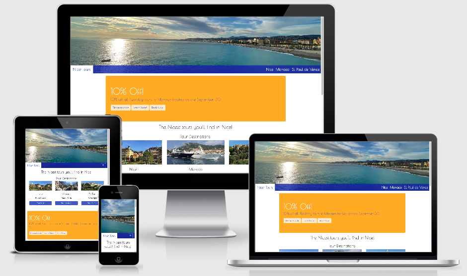

<h1 align="center"><a href="https://justin-sawyer.github.io/nicer-tours/index.html">Nicer Tours</a></h1>

This is the website for Nicer Tours, a new company offering sightseeing tours of the South of France.

Nicer Tours guarantee tour departures through their "Guaranteed Departure" tour option, the only tour company able to offer this.
Since tours have to be economically viable, many tours are cancelled during the off-season. Guaranteed departure allows the company to 
run a profitable organisation all year round.

However, the Guaranteed Departure option is not heavily promoted, because promoting a loss-leader is not a good business idea. Regular (Flexible Departures)
are promoted as a means to allow the customer to believe they are getting the best possible deal, since they always pay the lowest price in this option. Equally, promoting
Flexible Departure options allows the company to run with a maximum amount of customers for each tour.

## User Experience (UX)

- ### User stories:
    - #### First time visitors:

        1) As a first time visitor, I am either planning or am on my vacation in Nice, France and I want to visit a website that informs me about
the most interesting sights and places I can visit while on this vacation.

        2) I want to have my interest piqued while I view the website, and thus choose to make a booking for a tour.

        3) As a first time visitor to the website and perhaps to the geographical area covered in the site, 
I am perhaps uninformed about the area I am visiting, and thus want to be informed first and foremost 
before choosing to book or not. Because of this, I do not want to feel pressured to buy, however a 
little special offer may help me choose this company rather than another.

        4) I want to be able to navigate through the website easily, and be prompted where necessary to either 
contact the site creators (and service vendor) or make a booking easily if I choose to.

        5) As a first time visitor who is also on vacation, I want to be sure that I have made the right choice of 
tour company, so customer reviews and social comments about the company are very important.

    - #### Returning visitors:

        1) As a returning visitor, I want to be able to add my story to the many reviews I have seen on the website.

        2) As I will be returning to the site almost definitely after having taken a tour, I want to both be reminded 
of the fun I had, and also be able to inform others about the service offered by the company. Thus, good 
navigation and design are important, but so is the general informative nature of the services and sights offered on the site.

    - #### Frequent visitors:

        1) As a frequent visitor, I will probably be a professional in the tourist industry, since most people visit specific areas on vacation once only.
It is not in the remit of this project to offer a professional "back-door" entrance to the services of this site. However, it is partly for this that the 
discount popover has been included, along with the easy booking options on the book now page.

- ### Design:
    - #### Colour scheme:
        The project uses three main colours, both emblematic of the city of Nice. 
These three colours are the Yves Klein International Blue, contrasted with orange, and a pure white.

        1) Nice - main city of the *Côte d'Azur* which in itself means Blue Coast - is famous for its blue skies and 
blue sea. The Yves Klein International Blue (rgb 0,47,167) was created by the artist Yves Klein, himself born in Nice.

        2) Orange reminds the viewer of the Mediterranean sun, and is also the opposite of blue on color wheels.

        3) A pure, simple white background was chosen as white represents light, another quality of which Nice and the surrounding area is famous for.

    - #### Typography:

        Again, two distinct font styles have been used, but each compliments the other.

        1) Titles, headings and other "special use cases" (for example, the Call To Action banner) use the Poiret One font.
This font was chosen as it represents the *Belle Epoque* era of the 1920s and 30s, a time when the *Côte d'Azur* and Nice itself were
amongst the most fashionable of destinations.

        2) The Open Sans font was chosen as the typeset for the main body of the website. Although Poiret One is an extremely elegant font, it would have been
overkill to use this font uniquely. Thus, the equally elegant Open Sans font was chosen to compliment.

        Both fonts use Sans Serif as a fallback if for in any case the chosen fonts do not render.

    - #### Imagery:

        The website is designed to entice the user to either take a tour, to dream of their upcoming vacation or to tempt first time users to choose Nice and the *Côte d'Azur* for their next 
vacation destination. It is for this reason that wide panoramic photos have been used for the banners to each page, while scrolling images (carousels) have been used as a further navigational aid on the home page.

- ### Wireframes:
    A hard lesson has been learned here. When I first embarked on this project, I was convinced that I had a very good idea of what I wanted this project to
represent. And thus I did not believe a wireframe was particularly important. However, as the project evolved, grew and started to take shape, I have
realised how wrong this aasumption was! 

    [Home page for Desktop](https://justin-sawyer.github.io/nicer-tours/documentation/wireframe/desktop-home.png)

    [Tours for Desktop](https://justin-sawyer.github.io/nicer-tours/documentation/wireframe/desktop-tours.png)

    [Book Now for Desktop](https://justin-sawyer.github.io/nicer-tours/documentation/wireframe/desktop-book-now.png)

    [Home page for Mobile](https://justin-sawyer.github.io/nicer-tours/documentation/wireframe/mobile-home.png)

    [Tours for Mobile](https://justin-sawyer.github.io/nicer-tours/documentation/wireframe/mobile-tours.png)

    [Book Now for Mobile](https://justin-sawyer.github.io/nicer-tours/documentation/wireframe/mobile-book-now.png)

## Features:
1) This website is fully responsive.

2) It includes certain interactive elements, such as modals and popovers.

3) Although the project is not being marked on the inclusion of JavaScript elements, I have chosen to include one
in the inclusion of the Call To Action popover. I included it for the challenge of making it work.

## Technologies Used:
### Languages:
[HTML5](https://en.wikipedia.org/wiki/HTML5)

[CSS](https://en.wikipedia.org/wiki/CSS)

[JavaScript](https://en.wikipedia.org/wiki/JavaScript)

### Frameworks, Libraries & Programs:

[Bootstrap v4.5.2](https://getbootstrap.com/)
    forms the vast majority of the "formatting code" - the gird system, containers, button elements etc. - of this website. It was used because of its responsiveness and
    because it is compatible with so many browsers. While the underlying code may be from Bootstrap, I have in places heavily modified it
    (or tried to!). A good example of this is the Navigation bar. The colours used, the position of the site name and the colour of the "burger" 
    icon. Credit for additional code used within is given in the HTML files themselves.

[Google Fonts](https://fonts.google.com/)
    were used to import the different fonts (Poiret One and Open Sans) used on this website.

[Font Awesome v4.7.0](https://fontawesome.com/v4.7.0/)
    was used for the social icons seen in the footer of each page are from here, since they are so easily recognisable.

[Popper.js](https://popper.js.org/)
    was used for the little piece of JavaScript in this project: the positioning of the popover in the Call To Action.

[Git](https://git-scm.com)
    was used for version control.

[GitPod](https://www.gitpod.io/)
    was used as the writing tool. 

[GitHub](https://www.gitpod.io/)
    was used as the repository for the files within this project.

[Preview for Mac](https://support.apple.com/en-gb/guide/preview/welcome/mac)
    was used for image sizing (both in terms of height and width, and weight of file).

[Balsamiq](https://balsamiq.com)
    was used for the creation of the wireframes.

## Testing:

The W3C [HTML](https://validator.w3.org/) and [CSS](https://jigsaw.w3.org/css-validator/) code verification tools were used to ensure
there were no code errors in this project.

[Home](https://justin-sawyer.github.io/nicer-tours/documentation/code-verification/home.png)

[Book Now](https://justin-sawyer.github.io/nicer-tours/documentation/code-verification/book-now.png)

[CSS](https://justin-sawyer.github.io/nicer-tours/documentation/code-verification/css.png)

[Tour of Nice](https://justin-sawyer.github.io/nicer-tours/documentation/code-verification/nice.png)

[Tour of Monaco](https://justin-sawyer.github.io/nicer-tours/documentation/code-verification/monaco.png)

[Tour of St Paul de Vence](https://justin-sawyer.github.io/nicer-tours/documentation/code-verification/st-paul.png)

### Testing User Stories from User Experience (UX) Section
- #### First Time Visitor Goals
    1) As a first time visitor, I am either planning or am on my vacation in Nice, France and I want to visit a website that informs me about
    the most interesting sights and places I can visit while on this vacation.
        - Upon opening this website, the user is presented with a stunning banner image of the Bay of Angels. Within the navigation menu on desktop, 
        the user can clearly discern three "must-see" places, and is led to them via this menu.
        - Upon opening this website on mobile, the navigation menu is hidden by the "burger" icon. However, the user can still clearly see the most interesting
        places to visit, since there are 3 carousels turning beneath the main banner image. A tag-line for each place is followed by a link that allows the user to discover more
        about their choice of destination. It is precisely for this reason that the Call-to-Action is positioned beneath the carousels on smaller devices. 
        The destinations are the most important reason for visiting this site. 

    2) I want to have my interest piqued while I view the website, and thus choose to make a booking for a tour.
        - The user's interest is piqued, but not overwhelmed. This is achieved through the use of either expanding "Read More" buttons (on larger devices)
        or more direct accordian buttons (on mobile devices). As a tourist on vacation, the user prefers to be informed about the places the user will visit while 
        the user is on the tour, but if the user wants to find out more, the user has the choice to through these buttons.
        - 

    3) As a first time visitor to the website and perhaps to the geographical area covered in the site, 
    I am perhaps uninformed about the area I am visiting, and thus want to be informed first and foremost 
    before choosing to book or not. Because of this, I do not want to feel pressured to buy, however a 
    little special offer may help me choose this company rather than another.

    4) I want to be able to navigate through the website easily, and be prompted where necessary to either 
    contact the site creators (and service vendor) or make a booking easily if I choose to.
        - From experience with people of an elder generation, the carousel beneath the banner image is very important for ease of navigation. 
        The developer has had feedback from numerous people of an elder generation that they still are not used to navigating through the burger icon.

    5) As a first time visitor who is also on vacation, I want to be sure that I have made the right choice of 
        tour company, so customer reviews and social comments about the company are very important.

- #### Repeat Visitor Goals
    1) As a returning visitor, I want to be able to add my story to the many reviews I have seen on the website.

    2) As I will be returning to the site almost definitely after having taken a tour, I want to both be reminded 
    of the fun I had, and also be able to inform others about the service offered by the company. Thus, good 
    navigation and design are important, but so is the general informative nature of the services and sights offered on the site.

- #### Frequent Visitor Goals
    1) As a frequent visitor, I will probably be a professional in the tourist industry, since most people visit specific areas on vacation once only.
    It is not in the remit of this project to offer a professional "back-door" entrance to the services of this site. However, it is partly for this that the 
    discount popover has been included, along with the easy booking options on the book now page.

### Further Testing
- This website has been tested on Google Chrome, Safari, 

- This website has been tested on a variety of devices such as laptop, desktop, iPad (mini, full size), iPhone (SE, 6, 10, 11), 

- Links were chercked, double checked and triple checked.

- Friends, family and peers were asked to review this website to check for bugs, UX issues or design errors.

### Known Bugs:
1) The w3.org HTML validator suggests using a "polyfiller" to ensure all browsers are compatible with the "date" 
attribute in the form on the Book Now page.

## Deployment

## Credits
### Code
- [Bootstrap v4.5.2](https://getbootstrap.com/) was used extensively throughout this project for its responsive properties. 
Many elements were taken from the Bootstrap library, such as Carousels and Accordians, but each element has been heavily modified for the needs of this website.

- [W3Schools.com](https://www.w3schools.com/) was used extensively for research for this project.

- The [Rosie Odenkirk resumé project](https://justin-sawyer.github.io/ucd-resume/index.html)

- Where other 'non-original' code has been used, it has been credited within the html and css files.

### media

- Unless otherwise stated, all images are my own. Some may appear on [this website](https://www.sunnydaysnice.com). 
The website owners are my former employers, and used my photos for their website.
You can confirm this by email: welcome@sunnydays.fr

### Content

- All content written by the developer.

## Acknowledgements

[Code Institute](https://codeinstitute.net/) for the tuition, and the mentor I have been assigned.

[This little fellow](https://www.sciencephoto.com/media/1008843/view/colorectal-cancer-cell-sem) for making me see sense.

GG for the constant presence and encouragement. You are a pearl!

My former employer, The Travel Expert, in the tourism industry. Without them, I would not have been in a position to make such a detailed project.

## Future plans

## Cloning & deploying

You can clone and deploy this in your GitHub Desktop application by following these steps:

Navigate to this repository

Click the green "Code" button

Click "Open with GitHub Desktop"

Follow the prompts in the GitHub Desktop application.

## I hope you enjoy this project!